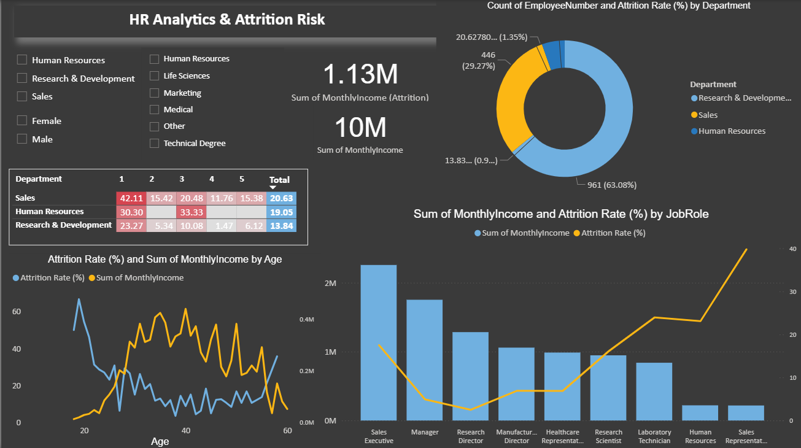
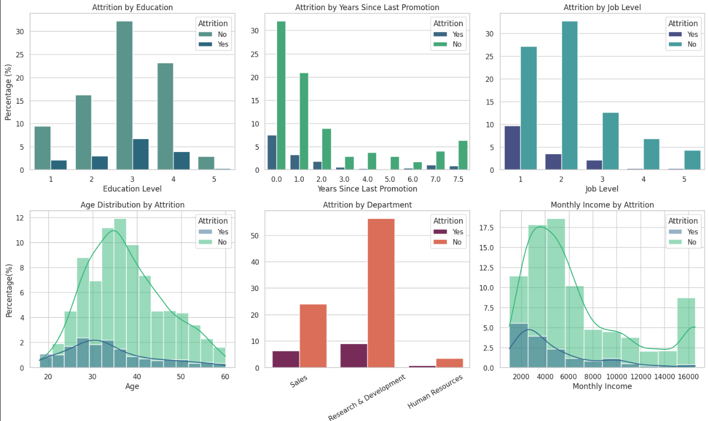
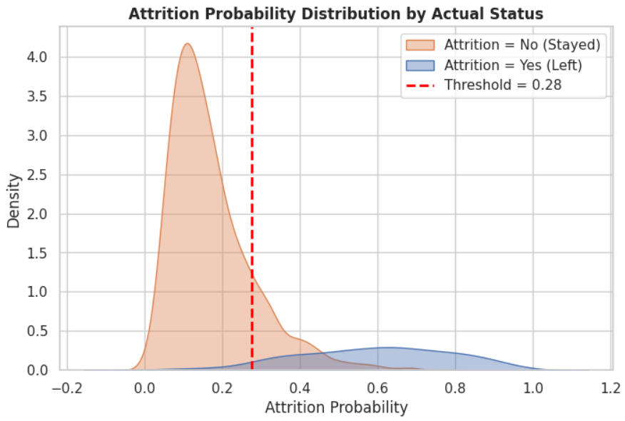
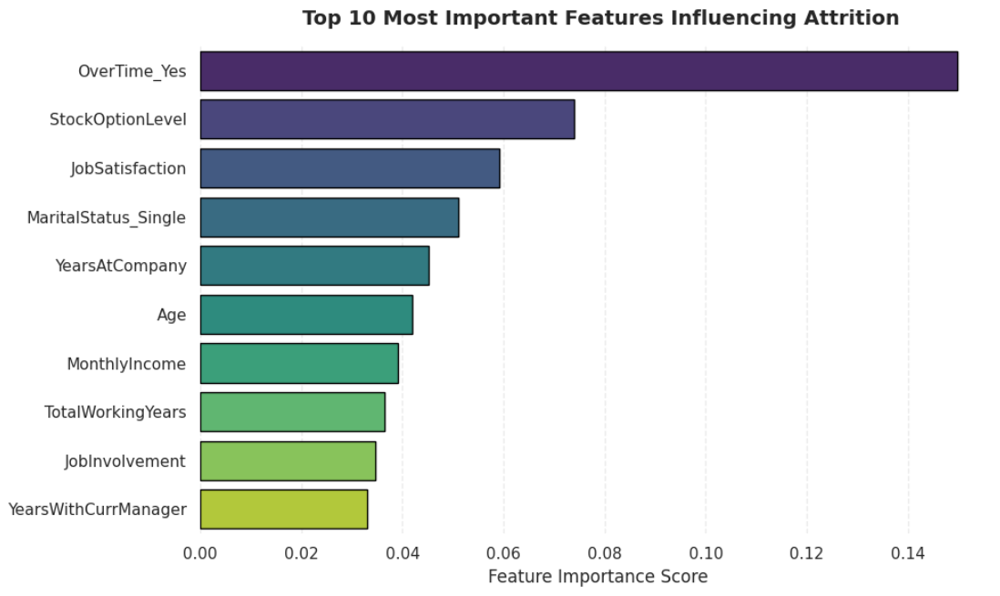

# 💼 HR Analytics & Attrition Risk Dashboard — Power BI + Machine Learning Project

---

## 📌 Project Overview
This project explores employee attrition patterns in a corporate HR dataset to identify key risk factors driving churn, particularly among early-career professionals in the **Sales Department**.  
The analysis combines **Power BI visualization** and **Machine Learning modeling** to create a unified, data-driven understanding of attrition risk.

---

## 🎯 Objectives
- Identify departments, age groups, and job levels most prone to attrition  
- Understand behavioral and financial factors leading to exits  
- Build an ML model to predict attrition probability for each employee  
- Recommend **data-driven HR interventions** to reduce turnover  

---

## 📁 Dataset Details
| Item | Description |
|------|--------------|
| **Dataset Name** | HR database1 |
| **Total Records** | ~1,470 employees |
| **Target Variable** | `Attrition (Yes/No)` |
| **Key Columns** | Demographics → Age, Gender, EducationField, MaritalStatus<br>Employment → JobLevel, Department, JobRole, MonthlyIncome, YearsAtCompany<br>Work Conditions → OverTime, DistanceFromHome |

---

## 🧰 Tools & Technologies
- **Power BI Desktop** – interactive dashboard & data modeling  
- **DAX (Data Analysis Expressions)** – KPIs and calculated metrics  
- **Python (Google Colab)** – EDA, preprocessing, Random Forest model  
- **Excel** – initial cleanup  
- **GitHub** – portfolio storage  

---

## 📊 Power BI Dashboard

### 📈 Attrition Analytics Dashboard


### 🔺 High-Risk Segments
- **Sales Department** → highest attrition (~20.6%)  
- **Job Level 1** employees show the most churn  
- **Age 20–30** → highest leavers  
- **Marketing/Sales** education → higher attrition  
- **Sales Representatives** → most vulnerable role

### 💰 Monthly Income Trends
- Strong inverse relationship → higher income = lower attrition  
- Sales Executives & Managers → stable  
- Sales Reps & Lab Technicians → high attrition risk

### 🚫 Non-Significant Factors
`DistanceFromHome`, `OverTime`, `MaritalStatus` → minimal impact on attrition

---

## 📈 EDA Visuals (Python Exploration)


---

## 🧮 Key DAX Measures
```DAX
Attrition Count =
CALCULATE(COUNTROWS(EmployeeData), EmployeeData[Attrition] = "Yes")

Attrition Rate (%) =
DIVIDE(
    CALCULATE(COUNTROWS(EmployeeData), EmployeeData[Attrition] = "Yes"),
    COUNTROWS(EmployeeData)
)

Sum of MonthlyIncome (Attrition) =
CALCULATE(SUM(EmployeeData[MonthlyIncome]), EmployeeData[Attrition] = "Yes")

Total MonthlyIncome = SUM(EmployeeData[MonthlyIncome])

Attrition Rate by Department =
CALCULATE([Attrition Count], ALLEXCEPT(EmployeeData, EmployeeData[Department])) /
CALCULATE(COUNT(EmployeeData[EmployeeNumber]), ALLEXCEPT(EmployeeData, EmployeeData[Department]))
```

---

## 🤖 Machine Learning Model Summary

| Step | Method |
|------|--------|
| **Encoding** | pd.get_dummies(X, drop_first=True, dtype=int) + LabelEncoder for target |
| **Scaling** | StandardScaler() |
| **Train/Test Split** | 80 / 20 (stratified) |
| **Imbalance Handling** | BorderlineSMOTE() |
| **Model** | RandomForestClassifier() (tuned) |
| **Performance** | Accuracy ≈ 0.83  ROC-AUC ≈ 0.80 |

**🎯 Optimal Probability Threshold ≈ 0.34**  
Employees with predicted probability ≥ 0..34 are classified as High Risk.

---

## 📉 Model Visualizations

### ROC Curve — Performance Evaluation


### Attrition Probability Distribution



### Feature Importance — Top 10 Predictaed Influencial Features 


---

## 📊 Model Performance

| Metric | Score |
|---------|-------|
| ** Test Accuracy** | 0.83 |
| ** Train Accuracy** | 0.97|
| **Recall adjusted**  | 0.83 |
| **F1 Score** | 0.82|
| **ROC-AUC** | 0.80 |

----
## 🧮 Top 10 Most Influential Features
| Rank | Feature              | Importance |
|------|----------------------|------------|
| 1️⃣  | OverTime_Yes         | 0.110      |
| 2️⃣  | YearsWithCurrManager | 0.065      |
| 3️⃣  | StockOptionLevel     | 0.055      |
| 4️⃣  | Age                  | 0.048      |
| 5️⃣  | JobLevel             | 0.046      |
| 6️⃣  | YearsAtCompany       | 0.045      |
| 7️⃣  | JobSatisfaction      | 0.043      |
| 8️⃣  | TotalWorkingYears    | 0.041      |
| 9️⃣  | YearsInCurrentRole   | 0.040      |
| 🔟   | MonthlyIncome        | 0.039      |


---

## 🧩 Final Model Interpretation

| Probability Range | Risk Level | HR Action |
|--------------------|-------------|------------|
| 0.00 – 0.28 | 🟢 Low Risk | Normal monitoring |
| 0.28 – 0.50 | 🟡 Moderate Risk | Review workload / satisfaction |
| 0.51 – 0.70 | 🟠 High Risk | Engage proactively |
| 0.71 – 1.00 | 🔴 Very High Risk | Immediate retention focus |

---


## ✅ Business Recommendations

### 1️⃣ Early-Career Retention
Focus on employees aged 20–30 in Sales and Job Level 1.  
Provide mentorship and salary review after 12 months.

### 2️⃣ Restructure Compensation
Sales Representatives are underpaid → introduce performance bonuses & promotion paths.

### 3️⃣ Ignore Low-Impact Factors
DistanceFromHome, MaritalStatus, and OverTime have limited influence — avoid policy bias.

---

## 🧠 Conclusion
This integrated Power BI + Machine Learning HR Analytics project provides a complete, data-driven view of attrition risk.  
It enables HR teams to:

- Detect at-risk employees early  
- Focus on key drivers like OverTime and Job Satisfaction  
- Implement targeted retention strategies  

---

## 📂 Repository Structure
```
📦 HR-Analytics-Attrition-Dashboard
├── 📊 Attrition_Analytics.png
├── 📈 EDA_dashboard.png
├── 📉 ROC_curve.png
├── 📊 probability_distribution.png
├── 📊 Top_10.png
├── 📓 HR_Analytics.ipynb
├── 📄 HR_database1.csv
└── 📖 README.md
```

---

## 🚀 How to Use This Project

1. **Clone the repository:**
```bash
   git clone https://github.com/yourusername/HR-Analytics-Attrition-Dashboard.git
```

2. **Open Power BI file** (if included) to explore the interactive dashboard

3. **Run the Jupyter Notebook** to reproduce the ML model:
```bash
   jupyter notebook HR_Analytics.ipynb
```

---

## 👤 Author
**Your Name**  
📧 souravmondal5f@gamil.com
🔗 [LinkedIn] (https://www.linkedin.com/in/sourav-mondal-7991b5373/)

---


---

## ⭐ Acknowledgments
- Dataset sourced from [IBM HR Analytics Employee Attrition & Performance]
- Inspired by real-world HR challenges in employee retention

---

**If you found this project helpful, please consider giving it a ⭐ on GitHub!**
