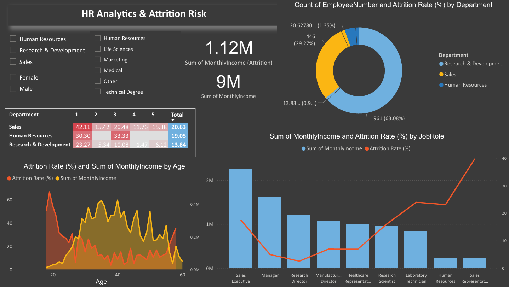
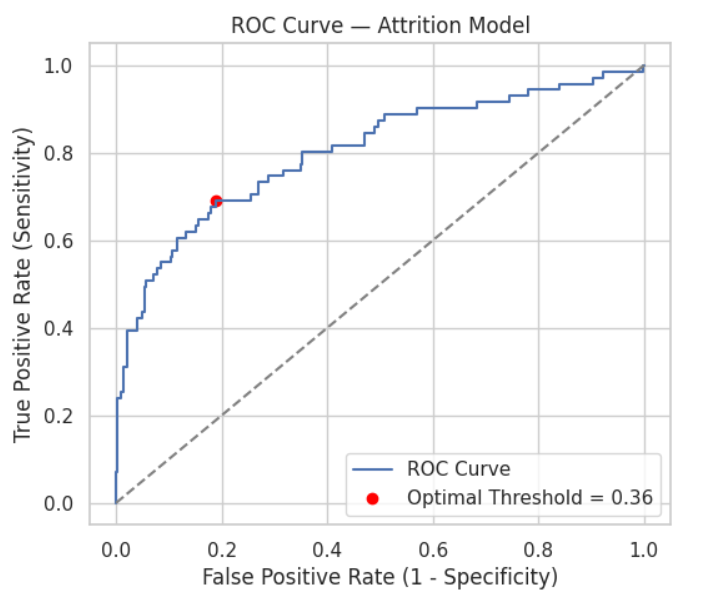
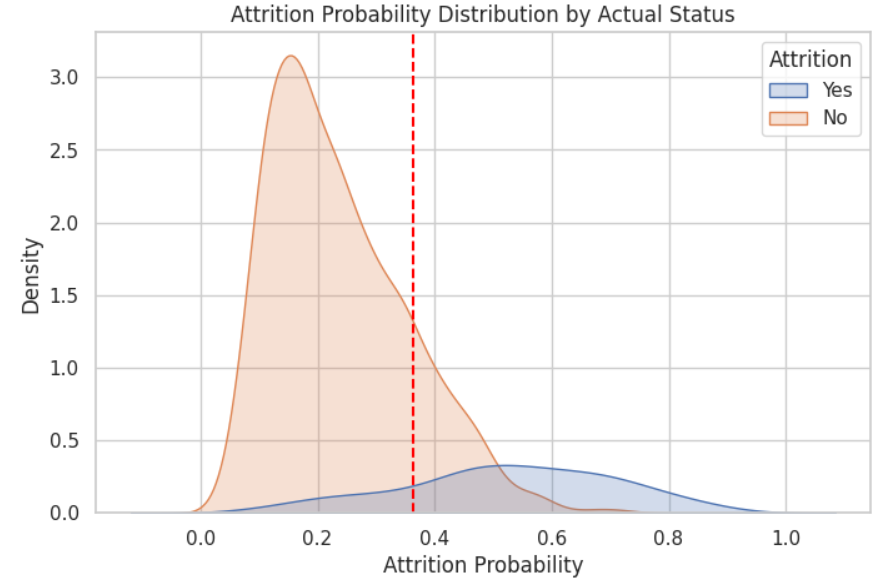

# 💼 HR Analytics & Attrition Risk Dashboard — Power BI + Machine Learning + AI

> **Predictive analytics system combining Power BI visualization, Machine Learning modeling, and AI-powered retention recommendations**

[](https://www.python.org/downloads/)
[](https://powerbi.microsoft.com/)
[](https://colab.research.google.com/)
[](https://scikit-learn.org/)
[](https://www.crewai.com/)

---

## 📌 Project Overview

Employee attrition is a critical challenge that impacts organizational productivity, culture, and profitability. This project delivers a **comprehensive HR analytics solution** that identifies attrition risk factors and empowers HR teams with data-driven retention strategies.

### What This Project Does

- 📊 **Visualizes** attrition patterns across departments, age groups, and job roles
- 🤖 **Predicts** individual employee attrition probability using Machine Learning
- 🧠 **Recommends** targeted retention actions using AI-powered decision support
- 💡 **Identifies** key drivers of employee turnover for strategic intervention

### Key Innovation

This project goes beyond traditional predictive analytics by integrating an **AI Retention Strategy Layer** that converts risk scores into actionable HR recommendations using CrewAI and Google Gemini.

---

## 🎯 Project Objectives

| Objective | Description |
|-----------|-------------|
| **Risk Identification** | Identify departments, age groups, and job levels most prone to attrition |
| **Driver Analysis** | Understand behavioral and financial factors leading to employee exits |
| **Predictive Modeling** | Build robust ML model to predict attrition probability for each employee |
| **Actionable Insights** | Translate predictions into data-driven HR interventions |
| **Strategic Planning** | Enable proactive retention strategies based on AI recommendations |

---

## 📁 Dataset Details

| Attribute | Details |
|-----------|---------|
| **Dataset Name** | IBM HR Analytics Employee Attrition & Performance |
| **Total Records** | ~1,470 employees |
| **Target Variable** | Attrition (Yes/No) |
| **Data Quality** | Clean dataset with minimal missing values |

### Feature Categories

**Demographics:**
- Age, Gender, Education Field, Marital Status

**Employment Information:**
- Job Level, Department, Job Role, Monthly Income, Years at Company

**Work Conditions:**
- Overtime, Distance from Home, Work-Life Balance, Job Satisfaction

**Career Progression:**
- Years with Current Manager, Years in Current Role, Total Working Years

---

## 🔍 Key Findings from Power BI Analysis

### 🔺 High-Risk Segments Identified

| Risk Factor | Finding | Business Impact |
|-------------|---------|-----------------|
| **Department** | Sales Department has highest attrition | Focus retention efforts on Sales team |
| **Job Level** | Job Level 1 employees show most churn | Early-career retention critical |
| **Age Group** | Age 20-30 has highest turnover | Young professionals need engagement |
| **Education** | Marketing/Sales education backgrounds | Review role alignment |
| **Job Role** | Sales Representatives most vulnerable | Compensation review needed |

### 💰 Income-Attrition Relationship

- **Strong inverse correlation:** Higher income = Lower attrition
- **Stable roles:** Sales Executives & Managers
- **High-risk roles:** Sales Representatives & Lab Technicians

> **Critical Insight:** Sales Representatives are underpaid relative to their attrition risk

---

## 📊 Power BI Dashboard



### Dashboard Components

The interactive Power BI dashboard provides:

- 📈 **Attrition Analytics:** Overall attrition rate and trends
- 👥 **Demographic Breakdown:** Attrition by age, gender, education
- 🏢 **Department Analysis:** Risk assessment by business unit
- 💵 **Income Distribution:** Salary trends across attrition status
- 📊 **Job Level Insights:** Career stage vulnerability analysis
- 🎯 **Risk Segmentation:** High, medium, low risk employee counts

### Key DAX Measures

```DAX
// Core Attrition Metrics
Attrition Count = 
CALCULATE(
    COUNTROWS(EmployeeData), 
    EmployeeData[Attrition] = "Yes"
)

Attrition Rate (%) = 
DIVIDE(
    [Attrition Count],
    COUNTROWS(EmployeeData),
    0
) * 100

// Income Analysis
Sum of MonthlyIncome (Attrition) = 
CALCULATE(
    SUM(EmployeeData[MonthlyIncome]), 
    EmployeeData[Attrition] = "Yes"
)

Total MonthlyIncome = 
SUM(EmployeeData[MonthlyIncome])

// Department-Level Analysis
Attrition Rate by Department = 
DIVIDE(
    CALCULATE(
        [Attrition Count], 
        ALLEXCEPT(EmployeeData, EmployeeData[Department])
    ),
    CALCULATE(
        COUNT(EmployeeData[EmployeeNumber]), 
        ALLEXCEPT(EmployeeData, EmployeeData[Department])
    ),
    0
)
```

---

## 🤖 Machine Learning Pipeline

### ⚙️ Data Preprocessing

```
1. Data Preparation
   ├── Encode categorical variables (pd.get_dummies with drop_first=True)
   ├── Encode target variable (LabelEncoder)
   └── Handle missing values (if any)

2. Feature Engineering
   ├── Scale numeric features (StandardScaler)
   └── Create train-test split (80/20 stratified)

3. Class Imbalance Handling
   └── Apply BorderlineSMOTE for balanced training
```

### 🏆 Model Selection

**Final Model:** Random Forest Classifier (Tuned)

**Why Random Forest?**
- Handles mixed data types effectively
- Provides feature importance rankings
- Robust to outliers and non-linear relationships
- Minimal hyperparameter tuning required

### 📈 Model Performance

| Metric | Train | Test |
|--------|-------|------|
| **Accuracy** | 0.97 | 0.83 |
| **Recall** | - | 0.83 |
| **F1 Score** | - | 0.82 |
| **ROC-AUC** | - | 0.80 |

✅ **Strong predictive power with good generalization**

### 🎯 Optimal Probability Threshold: **0.38**

Selected through ROC curve analysis to balance sensitivity and specificity.

---



## 🔝 Top 10 Most Influential Features

| Rank | Feature | Importance | Insight |
|------|---------|------------|---------|
| 1️⃣ | **OverTime_Yes** | 0.1349 | Strongest attrition predictor - work-life balance critical |
| 2️⃣ | **YearsWithCurrManager** | 0.0759 | Management relationship matters significantly |
| 3️⃣ | **YearsAtCompany** | 0.0553 | Company tenure stability factor |
| 4️⃣ | **StockOptionLevel** | 0.0551 | Financial incentives drive retention |
| 5️⃣ | **TotalWorkingYears** | 0.0527 | Overall career experience impacts decisions |
| 6️⃣ | **JobLevel** | 0.0514 | Seniority and career progression important |
| 7️⃣ | **Age** | 0.0477 | Career stage and life circumstances matter |
| 8️⃣ | **MaritalStatus_Single** | 0.0475 | Single employees show higher mobility |
| 9️⃣ | **JobSatisfaction** | 0.0405 | Employee engagement is key retention driver |
| 🔟 | **EnvironmentSatisfaction** | 0.0399 | Workplace environment impacts retention |

**Key Takeaway:** Work-life balance (OverTime) is by far the strongest predictor at 13.5% importance, followed by management relationships (7.6%) and tenure factors. Together, these top 3 features account for nearly 27% of the model's decision-making.


---

## 🎯 Risk Segmentation & Threshold Strategy

### Employee Risk Categories

| Probability Range | Risk Level | Prevalence | HR Action |
|-------------------|------------|------------|-----------|
| **0.00 – 0.15** | 🟢 Low Risk | Majority | Normal monitoring, standard programs |
| **0.15 – 0.38** | 🟡 Medium Risk | Significant | Review workload, check satisfaction |
| **≥ 0.38** | 🔴 High Risk | Critical | Immediate retention focus, intervention |

**Risk Segmentation Logic:**
```python
def attrition_risk(p):
    if p >= 0.38:  # Optimal threshold from ROC analysis
        return "High Risk"
    elif p >= 0.15:
        return "Medium Risk"
    else:
        return "Low Risk"
```

---

## 🤖 AI Retention Strategy Module

### System Architecture

```
┌─────────────────────────────────────────────────────────┐
│              MACHINE LEARNING LAYER                     │
│  • Random Forest predicts attrition probability         │
│  • Assigns risk segment based on 0.36 threshold         │
│  • Outputs: Probability + Risk Level                    │
└────────────────────┬────────────────────────────────────┘
                     │
                     ├── Low Risk → No AI Invocation
                     │
                     ├── Moderate Risk ──┐
                     │                   │
                     └── High Risk ──────┤
                                         │
                     ┌───────────────────┴────────────────┐
                     │       AI DECISION LAYER            │
                     │  • CrewAI orchestration            │
                     │  • Gemini 2.5 Flash reasoning      │
                     │  • Generates HR recommendations    │
                     └────────────────────────────────────┘
```

### Purpose of AI Integration

**The Gap:** Machine Learning identifies WHO is at risk, but not WHAT to do about it.

**The Solution:** AI layer translates risk scores into actionable HR strategies.

### How the AI Layer Works

1. **Input:** ML model predicts attrition probability for new employees
2. **Segmentation:** Employees categorized into risk levels using 0.38 threshold
3. **Conditional Trigger:** AI only activated for Medium and High Risk employees
4. **Recommendation:** Gemini generates concise, business-oriented retention actions
5. **Output:** Human-readable HR strategy (not raw predictions)

**What AI Receives:**
- ✅ Attrition probability
- ✅ Risk segment label

**What AI Does NOT Receive:**
- ❌ Raw employee features
- ❌ Training data
- ❌ Model internals
- ❌ Sensitive personal information

### Why Conditional AI Activation?

| Risk Level | AI Triggered? | Reason |
|------------|---------------|--------|
| 🟢 Low Risk (< 0.15) | ❌ No | Cost-efficient; no intervention needed |
| 🟡 Medium Risk (0.15-0.38) | ✅ Yes | Proactive recommendations valuable |
| 🔴 High Risk (≥ 0.38) | ✅ Yes | Critical retention strategies required |

**Benefits:**
- 💰 Reduces unnecessary API costs
- 🎯 Focuses AI on high-impact cases
- ⚖️ Avoids over-intervention for stable employees
- 🏢 Mirrors real-world HR workflows

### CrewAI Agent Configuration

```python
Agent: HR Retention Strategist
├── Role: Strategic HR advisor
├── Goal: Generate actionable retention recommendations
├── LLM: Google Gemini 2.5 Flash
├── Inputs: Attrition probability, Risk segment
├── Output: Concise business recommendations
└── Constraints: No access to raw data or model details
```

### Error-Resilient Design

```python
try:
    recommendation = crew.kickoff()
    return recommendation
except Exception as e:
    return "AI service temporarily unavailable. Use standard HR retention protocols."
```

**Handles Gemini API errors gracefully:**
- ✅ Pipeline continues without crashing
- ✅ Fallback to standard HR procedures
- ✅ Business logic remains intact
- ✅ Results remain auditable

> **Note:** Gemini 503 errors occur due to temporary cloud infrastructure load. This is a managed service limitation, not a code error.

### Sample AI Recommendations

**For Medium Risk Employee (0.25 probability):**
```
Recommendation: Schedule quarterly check-ins to assess job satisfaction 
and workload balance. Review compensation against market benchmarks. 
Consider role enrichment opportunities.
```

**For High Risk Employee (0.40 probability):**
```
Recommendation: Immediate stay interview required. Investigate overtime 
patterns and manager relationship. Prepare retention offer including 
potential promotion path or stock options. Escalate to department head.
```

---

## 📊 Model Visualizations

### ROC Curve Analysis
The ROC curve demonstrates strong discriminative power with AUC = 0.80, indicating the model effectively separates employees who will leave from those who will stay.

### Probability Distribution
Shows clear separation between attrition classes, with optimal threshold at 0.36 providing balanced precision-recall tradeoff.

### Feature Importance Chart
Visualizes the top 10 predictive features, highlighting OverTime as the dominant factor in attrition decisions.

---

## ✅ Business Recommendations

### 1️⃣ Early-Career Retention Program

**Target:** Employees aged 20-30 in Sales and Job Level 1

**Actions:**
- Implement structured mentorship programs
- Conduct salary review after 12 months
- Create clear promotion pathways
- Increase manager touch-points during first year

### 2️⃣ Sales Compensation Restructure

**Finding:** Sales Representatives are underpaid relative to attrition risk

**Actions:**
- Introduce performance-based bonuses
- Review base salary competitiveness
- Establish clear career progression to Sales Executive
- Implement retention incentives (stock options)

### 3️⃣ Work-Life Balance Initiatives

**Finding:** OverTime is the strongest attrition predictor

**Actions:**
- Monitor and limit excessive overtime
- Review workload distribution in high-attrition departments
- Implement flexible working arrangements
- Track and address burnout indicators

### 4️⃣ Manager Relationship Development

**Finding:** Years with Current Manager is 2nd most important feature

**Actions:**
- Train managers in retention best practices
- Conduct regular skip-level meetings
- Implement 360-degree feedback
- Address toxic management situations promptly

### 5️⃣ Avoid Low-Impact Interventions

**Finding:** Distance from Home, Overtime, Marital Status show minimal impact

**Actions:**
- Don't overinvest in commute-related benefits
- Focus resources on proven retention drivers
- Avoid policy changes based on demographic assumptions

---

## 🛠️ Technical Stack

| Category | Technology |
|----------|------------|
| **Platform** | Google Colab |
| **Visualization** | Power BI Desktop |
| **Data Processing** | pandas, numpy |
| **Machine Learning** | scikit-learn, Random Forest |
| **Class Balancing** | imbalanced-learn (BorderlineSMOTE) |
| **Feature Scaling** | StandardScaler |
| **Encoding** | LabelEncoder, pd.get_dummies |
| **AI Orchestration** | CrewAI |
| **LLM** | Google Gemini 2.0 Flash |
| **Analytics Language** | DAX (Data Analysis Expressions) |
| **Development** | Python 3.8+, Jupyter Notebook |

---

### Key Implementation Steps

```python
# Step 1: Load and preprocess data
import pandas as pd
from sklearn.preprocessing import StandardScaler, LabelEncoder

df = pd.read_csv('HR_database1.csv')
X = pd.get_dummies(df.drop('Attrition', axis=1), drop_first=True, dtype=int)
y = LabelEncoder().fit_transform(df['Attrition'])

# Step 2: Handle class imbalance
from imblearn.over_sampling import BorderlineSMOTE
smote = BorderlineSMOTE(random_state=42)
X_resampled, y_resampled = smote.fit_resample(X_scaled, y_train)

# Step 3: Train Random Forest
from sklearn.ensemble import RandomForestClassifier
model = RandomForestClassifier(
    n_estimators=200,
    max_depth=10,
    min_samples_split=5,
    random_state=42
)
model.fit(X_resampled, y_resampled)

# Step 4: Generate predictions with risk segments
probabilities = model.predict_proba(X_test)[:, 1]

# Apply risk segmentation with optimal threshold
def attrition_risk(p):
    if p >= 0.38:
        return "High Risk"
    elif p >= 0.15:
        return "Medium Risk"
    else:
        return "Low Risk"

risk_segments = [attrition_risk(p) for p in probabilities]

# Step 5: Get AI recommendations for at-risk employees
from crewai import Agent, Task, Crew

for employee, prob, risk in zip(employees, probabilities, risk_segments):
    if risk in ['Medium Risk', 'High Risk']:
        recommendation = get_ai_recommendation(prob, risk)
        print(f"Employee {employee}: {recommendation}")
```

---

## 📈 Business Impact

### Quantifiable Benefits

- 🎯 **83% prediction accuracy** for attrition identification
- 🔍 **0.80 ROC-AUC score** for risk ranking capability
- 💰 **Focus on Sales Department** (highest ROI opportunity)
- ⚡ **Early intervention** for Job Level 1 employees
- 🤖 **AI-powered strategies** for retention planning
- 📊 **Interactive dashboards** for real-time monitoring

---

## 📊 Project Structure

```
HR-Analytics-Attrition-Dashboard/
├── HR_Analytics.ipynb              # Main analysis notebook
├── HR_database1.csv                # Employee dataset
├── Attrition_Dashboard.pbix        # Power BI dashboard file
├── powerbidash.png                 # Dashboard screenshot
├── roc.png                         # ROC curve visualization
├── distribution.png                # Probability distribution plot
├── feature_importance.png          # Top 10 features chart
└── README.md                       # Project documentation
```


---

## 👤 Author

**Sourav Mondal**

- 📧 Email: souravmondal5f@gmail.com
- 🔗 LinkedIn: [Sourav Mondal](https://www.linkedin.com/in/sourav-mondal-7991b5373/)
- 💼 GitHub: [@create-sourav](https://github.com/create-sourav)

---

## 🙏 Acknowledgments

- **Dataset Source:** IBM HR Analytics Employee Attrition & Performance
- **Inspiration:** Real-world HR challenges in employee retention and organizational development
- **Tools:** Anthropic Claude, Google Gemini, Power BI, scikit-learn community
- **Methodology:** Inspired by modern HR analytics and people analytics best practices

---

## 📚 Additional Resources

### Further Reading

- [Employee Retention Strategies - Harvard Business Review](https://hbr.org/)
- [Machine Learning for HR Analytics - Towards Data Science](https://towardsdatascience.com/)
- [Power BI Best Practices - Microsoft Docs](https://docs.microsoft.com/power-bi/)

### Related Projects

- Telecom Customer Churn Prediction
- Customer Lifetime Value Prediction
- Sales Forecasting with Time Series Analysis

---

## 📌 Project Status

### ✅ Production-Ready

This project delivers a **comprehensive, production-ready HR attrition prediction and retention system** featuring:

- ✅ Interactive Power BI dashboards
- ✅ Validated machine learning model (83% accuracy)
- ✅ AI-powered decision support
- ✅ Actionable business recommendations
- ✅ Error-resilient architecture
- ✅ Clear deployment pathway

**Ready for enterprise HR deployment with proper governance and monitoring.**

---

<div align="center">

**⭐ If you find this project useful, please consider giving it a star! ⭐**

**🤝 Connect with me on [LinkedIn](https://www.linkedin.com/in/sourav-mondal-7991b5373/) for collaborations!**

</div>
